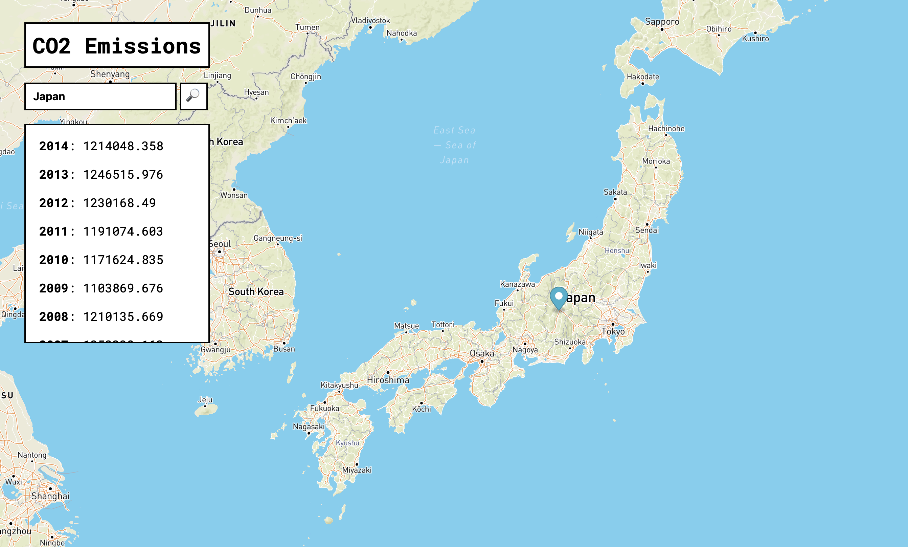

# Modelling CO2 emissions from around the world



Frontend written with Typescript + React

Backend written in node/express with the following endpoints: 
  - GET `/info/:country` 
  ```
  {
    "timezones": [
      "Europe/Helsinki"
    ],
    "latlng": [
      64,
      26
    ],
    "name": "Finland",
    "country_code": "FI",
    "capital": "Helsinki"
 }
```
  - GET `/emissions/:country`
```
[
  {
    "countryName": "Finland",
    "key": "FIN",
    "year": "1960",
    "value": "15104.373"
  },
  {
    "countryName": "Finland",
    "key": "FIN",
    "year": "1961",
    "value": "14939.358"
  },
  {
    "countryName": "Finland",
    "key": "FIN",
    "year": "1962",
    "value": "16809.528"
  },
  ...
]
```

